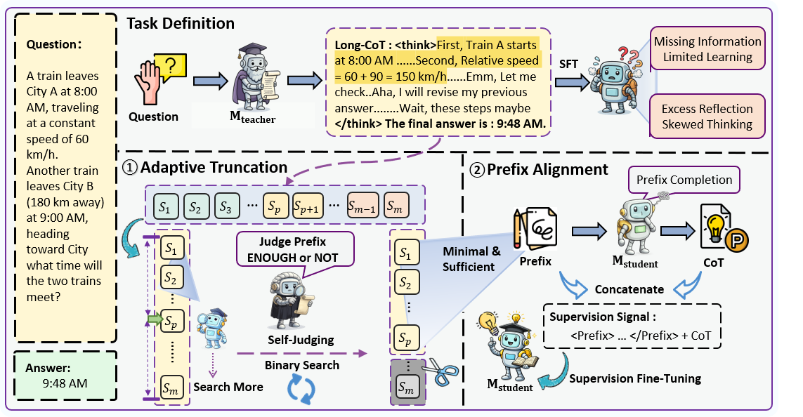

# Long-Chain Reasoning Distillation via Adaptive Prefix Alignment

This repository contains the source code for the paper: [Long-Chain Reasoning Distillation via Adaptive Prefix Alignment]().


<p align="center">
  <a href="https://arxiv.org/pdf/xxxx.xxxxx">
    
  </a>
  <a href="https://huggingface.co/papers/xxxx.xxxxx">
    
  </a>
  <a href="https://huggingface.co/qizheyanger/P-ALIGN">
    
  </a>
</p>

<!-- <p align="center">
  <a href="https://arxiv.org/pdf/xxxx.xxxxx">
    
  </a>
  <a href="https://huggingface.co/papers/xxxx.xxxxx">
    
  </a>
  <a href="https://huggingface.co/qizheyanger/ORION">
    
  </a>
</p -->


<div align="center">
<p align="center" dir="auto">

• 🎯 [Overview](#overview) 
• ⚙️ [Set Up](#Set-Up)
• 🔧 [Reproduction Guide](#reproduction-guide)
</p>
<p align="center" dir="auto">

• ✈️ [Experimental Result](#experimental-result) 
• 📃 [Acknowledgement](#acknowledgement) 
• 📝 [Citation](#citation)
• 📨 [Contact](#contact)
</p>
</div>


## 🎯Overview

**Prefix-ALIGN** is a distillation framework that leverages **adaptive prefix alignment** to improve student model reasoning. It truncates teacher Chains-of-Thought (CoTs) and selects **concise, informative prefixes** as supervision, effectively bridging the gap between teacher trajectories and student capacity. P-ALIGN enables student models to learn from high-quality CoTs without being hindered by redundancy or uncertainty.


<p align="center">
    
</p>

  


## ⚙️Set Up

### 1. Python Environment.

Use git clone to download this project.

```bash
conda create -n P-ALIGN python=3.10
conda activate P-ALIGN
git clone https://github.com/NEUIR/P-ALIGN.git
cd P-ALIGN
pip install -r requirements.txt --force-reinstall --no-deps --no-cache-dir
```
### 2. Install LLaMA-Factory.
Refer to [https://github.com/hiyouga/LLaMA-Factory](https://github.com/hiyouga/LLaMA-Factory) for detailed instructions.

```bash
conda create -n llama_factory python=3.10
conda activate llama_factory
git clone --depth 1 https://github.com/hiyouga/LLaMA-Factory.git
cd LLaMA-Factory
pip install -e ".[torch,metrics]"
```

## 🔧P-ALIGN Pipeline
### 1、Response-Sampling

```bash
bash scripts/Response_sampling.sh 
```

### 2、Self-Reflection

```bash
bash scripts/Self-Reflection.sh 
```

### 3、Training the model


```bash
bash scripts/sft.sh 
```

### 4、Evaluation

```python
python src/eval_final.py
```


## 📨Contanct
If you have questions, suggestions, and bug reports, please email:
```bash
2401934@stu.neu.edu.cn
```


